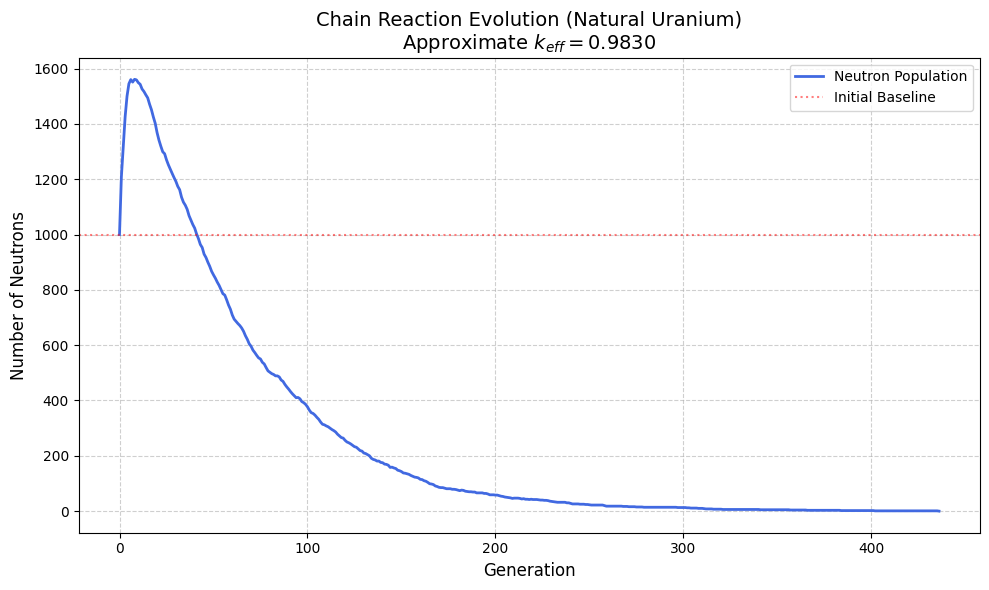

# ⚛️ Monte Carlo Neutron Transport Simulator


## 📄 Overview
This project is a probabilistic **Monte Carlo simulation** designed to study the criticality of **Natural Uranium** (0.7% U-235).

Starting from a simplified mathematical model (binary fission/absorption), the project evolves into a **physically accurate engine** that integrates:
- Continuous energy dependence (eV to MeV).
- Nuclear cross-sections ($\sigma_f, \sigma_c, \sigma_s$) based on ENDF data.
- **Watt Spectrum** for fission neutron energy distribution.
- Competitive physical processes: Fission vs. Radiative Capture vs. Elastic/Inelastic Scattering.

The simulation correctly validates that natural uranium in an infinite medium is **subcritical** ($k_{eff} < 1$) due to the resonance capture phenomenon in U-238.

## 📊 Key Results
The simulation tracks the neutron population over generations. Unlike simplified models that predict infinite growth, the physics-aware model demonstrates the "resonance trap" effect.


*(Replace this with your actual graph image file)*

**Result Analysis:**
- **Initial Spike:** Caused by the injection of thermal neutrons into a high-fission cross-section environment.
- **Decay:** As new neutrons are born fast (MeV) and slow down, they are captured by U-238 resonances before inducing further fission.
- **Calculated $k_{eff}$:** ~0.983 (Subcritical).

## 🛠️ Technical Implementation

### Physics Engine
The core logic relies on random walk algorithms to simulate neutron life cycles:
1.  **Inverse Transform Sampling:** Used to generate fission energies following the **Watt Spectrum**:
    $$f(E) = C e^{-aE} \sinh(\sqrt{bE})$$
2.  **Interaction Sampling:** Probabilities for fission, capture, and scattering are dynamically calculated based on the neutron's current energy and interpolated cross-section data.
3.  **Moderation:** Implementation of energy loss via elastic (billiard-ball) and inelastic collisions.

### Code Snippet: Watt Spectrum Sampling
```python
def get_watt_sample():
    # Numerical inversion of the Cumulative Distribution Function (CDF)
    # to sample neutron energies from the Watt Spectrum.
    x = np.linspace(0, 15, 5000) 
    pdf = C * np.exp(-a * x) * np.sinh(np.sqrt(b * x))
    cdf = np.cumsum(pdf)
    cdf = cdf / cdf[-1]  # Normalize
    
    u = np.random.random()
    sample = np.interp(u, cdf, x)
    return sample
```
## 🚀 How to Run
1. Clone the repository:
   ```bash
   git clone [https://github.com/jmalfaro2019/PROJET.git](https://github.com/jmalfaro2019/PROJET.git)
2. Install dependencies:
   ```bash
   pip install numpy matplotlib scipy
   ```
3. Run the simulation script:
   ```bash
   python main.py
   ```
## 📚 Project Structure
```bash
PROJET/
│
├── .gitignore           
├── README.md              
├── requirements.txt      
├── main.py               
│
├── src/                  
│   ├── material.py
│   ├── physics.py
│   └── simulation.py
│
├── docs/                  
│   ├── Rapport_fr.pdf
│   └── Rapport_eng.pdf
│
├── notebooks/             
│   └── sim.ipynb
│
└── results/              
    └── simulation_result.png
```
## 🧠 Skills Demonstrated
- **Scientific Computing:** NumPy, Statistical Modeling, Numerical Integration.
- **Physics Simulation:** Monte Carlo methods, Particle Transport.
- **Data Visualization:** Matplotlib for analyzing population dynamics.
- **Technical Writing:** Comprehensive LaTeX reporting.

---
*Project developed as part of a montecarlo coursework by Jose Alfaro, Luc Eustachon, Farah Dogui and Rana Korchid.*
